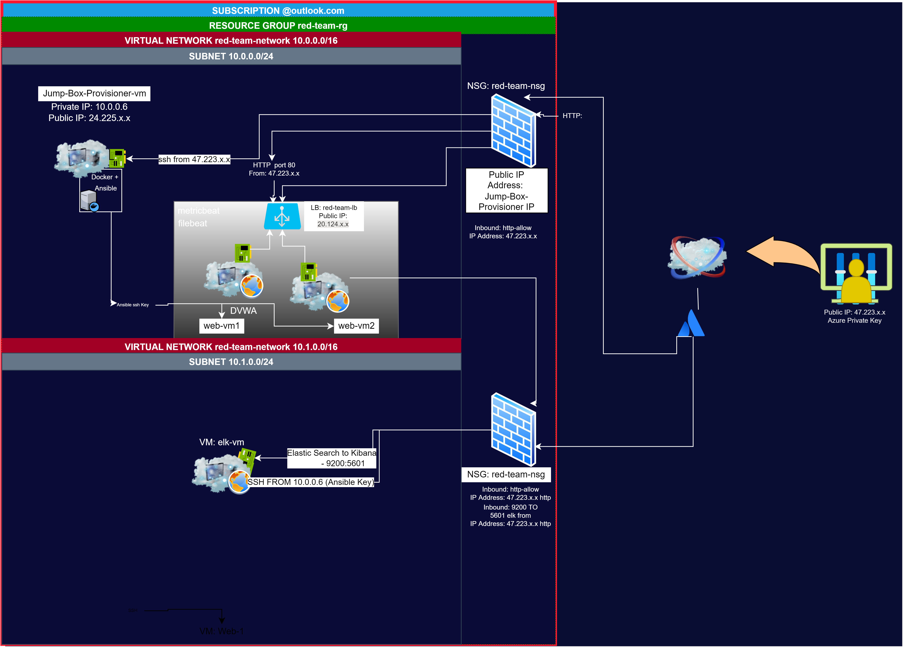

## Automating Deployment of ELK stack within Microsoft Azure

The  files in this repository were used to configure the network  depicted below 

These files have been tested and used to generatea a live ELK deployment on Azure. They can be used to either recreate the entire deployment pictured above. Alternatively, select portions of the main.yaml file may be used to install only select pieces of it, such as Filebeat.

- _main.yaml_

The main file is a composited collection consisting of: 

- _elk-config.yaml_
- _filebeat.yaml_
- _metricbeat.yaml_

### Topology Description

The main purpose of this network is to expose a load-balanced and HIDS monitored instance of DVWA, the D*mn Vulnerable Web Application

Load balancing ensures that the applicatoin will be highly available in stressful situations, in addition to restricting _ports_ to the network.

- Load balancers have a lot to do with the availability of a webserver. If one server is stressed and moving slow, or has been entirely made unaivalible to the public network through Ddos or numerous stress attempts internally, the Load balancer is able to then redirect public traffic to the second machine either in the same region or a different one. One great advantage of a jump box is to have it be the ingres point into the local network of the web servers. 

- Integrating an ELK server allows users to easily monitor the vulnerable VMs for changes to the system metrics and file intent. The ELK server serves as an IDS 
- _metricbeat_ - machine metrics and uptime
- _filebeat _file system and data

# project Overview
Can only have 4 machines. Need another virtual net for the elk server. 

Great sources to look are creating ticket from azure. 

# operations consist of 

- creating a new network within the same reource group.
- making a vm with a lot of memory
- also note that static ip's are important when leaving your nsg's rules in tact. If you are managing your cost by stopping the machines, and if your host machine doesn't have a static public ip address, you may find yourself udating your rules frequently.

| Name     | Function | IP Address | Operating System |
|----------|----------|------------|------------------|
| Jump Box | Gateway  | 10.0.0.6   | Linux            |
| web-lb.  | Load bal.| 20.124.x.x | V-Network Device |
| web-vm1  | Web Host | 10.0.0.7   | Linux            |
| web-vm2  | Web Host | 10.0.0.8   | Linux            |
|----------|----------|------------|------------------|
| elk-vm   | P2P IDS  | 10.1.0.4   | Linux            |
             
--------------

# docker containers

| Name     | Container| IP Address | Operating System |
|----------|----------|------------|------------------|
| Jump Box | Ansible  | 10.0.0.6   | Linux            |
| web-vm1  | DVWA     | 10.0.0.7   | Linux            |
| web-vm2  | DVWA     | 10.0.0.8   | Linux            |
|----------|----------|------------|------------------|
| elk-vm   | sebp/ELK | 10.1.0.4   | Linux            |
             
--------------

# Access Policies 

The machines on the internal network are not exposed to the public network.

the elk-vm and web-lb are the only items with public ip addressses, where the elk-vm obtains access by an network of security engineers & security architects. 

- elk will have the following port mappings later: 
	- 5601:5601
	- 9220:9220
	- 5440:5440

A summary of the access policies in place can be found in the table below. *** mustdo 

| Name     | Publicly Accessible | Allowed IP Addresses |
|----------|---------------------|----------------------|
| Jump Box | No                  | [red-team]           |
| web-lb   | Yes                 | Any                  |
| web-vm1&2| No                  | 10.0.0.6 (Jump-Box)  |

### Elk Configuration
No configuration was performed manually and this is advantageous because automating the configuration of the ELK machine doesn't envoke error or any discrepencies between the vm's.

Automating machines in this manner reduces error and provides a layer of consistancy to your security stack similar to why we had a load balancer in front all the web-vm's. 

The playbook implements the following tasks:

-    elk playbook, installs docker.io via ansible.builtin.apt 
-    instlaling python3-pip via apt
-    installing docker module using pip 
-    increate virtual memory using sysctl
-    start on boot & check status

The following screenshot displays the result of running `docker ps` after successfully configuring the ELK instance.

### Target Machines & Beats
This ELK server is configured to monitor the following machines:
- 10.0.0.7
- 10.0.0.8

We have installed the following Beats on these machines:
- Filebeat & Metric Beat

These Beats allow us to collect the following information from each machine:
- Filebeat and Metricbeat can be found within kibana installed on your elk-vm with more documentation available there. 
- From Kibana's [http//20.122.x.x:5601/app/kibana#/home] you can see under ther 'Observability' section: Logs and Metrics with the option to add metric data from the beats we wish to install. 
- If you click System logs, file beat install documentation will be presented where you may also check the data that is being sent to your Kibana.
- Filebeat is going to collect and parse logs in Unix/Linux environment.
- Metricbeat is "Docker metrics" and you are able to fetch integral data about our Docker containers. 
- Filebeat is system data and Metricbeat is to fetch container metrics.

# If Windows Machine
- _`Winlogbeat`_ collects Windows logs, which we use to track user logon events, etc.

### Using the Playbook to install ELK server 
In order to use the playbook, you will need to have an Ansible control node already configured. Assuming you have such a control node provisioned: 

SSH into your jump box and attach to the ansible container `docker attach container-name`
- Copy the _elk-playbook-install.yml_ file to ~/playbook/.
- Update the  file to include `hosts: [elk]`. Change this to `[webservers]` to install your beats on the web-vm's. 
- Hosts can be specified by `[10.0.0.7 ansible_python_interpreter=/usr/bin/python3]` in /etc/ansible/hosts.
- [webservers]
10.0.0.7 ansible_python_interpreter=/usr/bin/python3
10.0.0.8 ansible_python_interpreter=/usr/bin/python3

- you can do the same thing for your elk server to tun on that particular machine. 

- Run the playbook , and navigate to `http://20.122.x.x:5601/app/kibana#/home` to check that the installation worked as expected. Or you can navigate to your `elk-public-ip:5601` and you will be redirected to kibana. 

_As a **Bonus**, provide the specific commands the user will need to run to download the playbook, update the files, etc._

